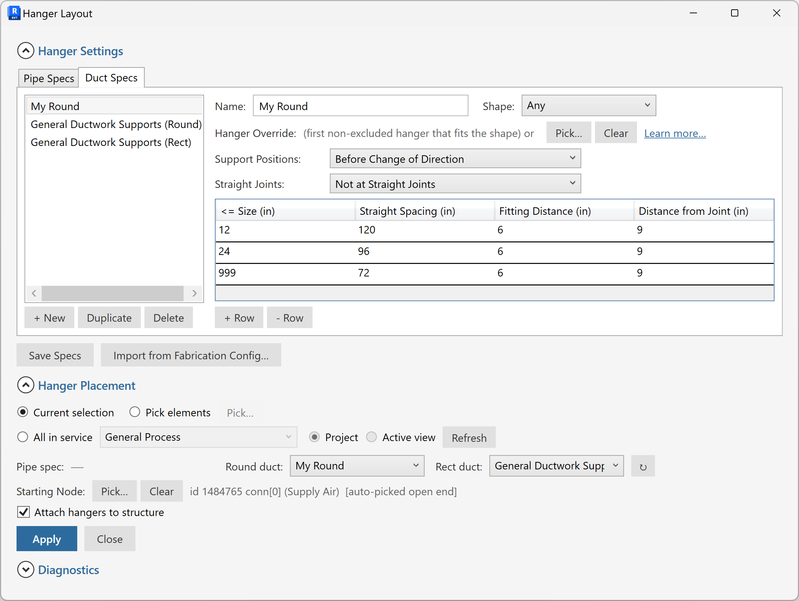

# Hanger Layout for Revit

A Revit add-in (builds for **Revit 2023, 2024, 2025, and 2026**) that places
pipe and duct hangers along selected runs of **Autodesk Fabrication parts**,
using size-banded spacing rules you define once and reuse across the project.

The dialog is modeless — you can pick parts in the model while it's open,
edit your specifications inline, and apply them without closing the window.
Specifications are stored on the Revit project, so they survive save/close
cycles and travel with the model.

---

## ⚠ Disclaimer

This code is provided by Autodesk for evaluation purposes only, as an example
of what is possible with the Autodesk platform and APIs. **THIS CODE IS NOT
INTENDED FOR USE IN PRODUCTION.** Autodesk makes no representations,
warranties, or commitments about the code. This code is not fully tested
and may include errors or faults that may cause total data loss or system
failure. No further updates to this tool are promised or implied — the
version published here may be the last, and may never be revised after the
posting date.

The MIT license applies to the source — see [LICENSE](LICENSE) — but the
evaluation-only nature above takes precedence over any "use however you
like" reading of the MIT terms.

---

## What it does

- **Build size-banded spec tables for pipes and ducts** — e.g. "0–2 in: 6 ft
  spacing, 1 ft from fittings, 6 in from joints", plus per-row anchor setback,
  insulated hanger OD, and insulation-insert type, all editable inline.
- **Apply to a selection** — picks one button per service per shape (Round
  duct vs Rectangular duct vs Pipe), walks the selected straight runs end-
  to-end, and drops hangers at the right intervals.
- **Chain-spanning placement** — when a long run crosses joints (couplings,
  flanges, welds), hangers space correctly across the joints, accounting
  for the joint piece's own length.
- **Per-service Hanger Type** — each spec row picks its hanger from a dropdown
  of the hanger buttons defined for that service in your Fabrication config, or
  lets the tool auto-pick the first compatible one for the part's shape. On
  Apply, the chosen button is placed and the row's rod diameter is written to
  the hanger.
- **Import a hanger schedule (CSV / Excel)** — bring a size-banded schedule in
  from a `.csv` or `.xlsx`: each row's Service / Media / Material / Insulation /
  Size sets the spacing, fitting & joint setbacks, hanger type, and rod diameter.
  Column matching is tolerant (several candidate headers per field). Merge with
  what you already have, or replace.
- **Import from Fabrication Config** — read your existing `HSpecs.MAP`
  Hanger Specifications straight out of the active Fab database. Merge with
  what you already have, or replace.
- **Load from Model** — generate a starter schedule from the fabrication
  pipework already in your model (services and sizes are read off the parts),
  the same way the QA wizard builds its table — no manual entry to begin.
- **Export to CSV** — write the current grid back out to a `.csv` to edit
  externally and re-import, round-tripping the whole schedule.

---

## Install (no compiling required)

1. **Download the ZIP that matches your Revit version** from this repo's
   [Releases](https://github.com/Ty9112/harris-hanger-layout/releases):
   - `HangerLayout-Revit2023-v1.2.0.zip` for Revit 2023
   - `HangerLayout-Revit2024-v1.2.0.zip` for Revit 2024
   - `HangerLayout-Revit2026-v1.2.0.zip` for Revit 2026
   - Revit 2025: no prebuilt ZIP yet — build from source (see
     [Modify the code](#modify-the-code)); the 2025 target is supported.
2. Extract **all files** from the ZIP. The Revit 2023/2024 builds bundle a few
   dependency DLLs next to `HangerLayout.dll` + `HangerLayout.addin` — keep them
   together (Revit loads them from the same folder).
3. Drop **all the extracted files** into your version-matched Revit add-ins folder:
   - Revit 2023 → `%APPDATA%\Autodesk\Revit\Addins\2023\`
   - Revit 2024 → `%APPDATA%\Autodesk\Revit\Addins\2024\`
   - Revit 2025 → `%APPDATA%\Autodesk\Revit\Addins\2025\`
   - Revit 2026 → `%APPDATA%\Autodesk\Revit\Addins\2026\`

   (paste either path into File Explorer's address bar — it expands to
   your user folder.)
4. Restart Revit. You'll see a new **Hanger Layout** ribbon tab.

If Revit blocks the DLL on first launch with a security warning, right-click
`HangerLayout.dll` → **Properties** → tick **Unblock** at the bottom → OK.
That's a one-time Windows quirk for DLLs downloaded from the internet.

Full step-by-step with screenshots: [docs/installation.md](docs/installation.md).

---

## Quick start

1. Open a Revit model that contains Fabrication parts (pipes or ducts).
2. On the **Hanger Layout** tab, click **Hanger Layout**.
3. Add a spec row to **Pipe Specs** or **Duct Specs** — e.g. "Up to 6 in,
   spacing 10 ft, fitting setback 1 ft, joint setback 6 in".
4. Click **Save Specs**.
5. In **Hanger Placement**, pick a Service (Pipe Type / Hanger button), then
   **Apply** with parts selected.

> **Shortcut:** instead of adding spec rows by hand, click **Import Table
> (CSV/Excel)** to load a whole hanger schedule at once — see
> [`docs/sample-hanger-schedule.csv`](docs/sample-hanger-schedule.csv) for the
> expected columns and units. **Import from Fabrication Config** pulls specs
> straight from your Fab database's `HSpecs.MAP`. **Load from Model** builds the
> table from the parts already in your model, and **Export to CSV** writes it
> back out to edit and re-import. (Load from Model reads fabrication pipework.)

Full user guide: [docs/user-guide.md](docs/user-guide.md).

---

## Modify the code

The repo **multi-targets** — net48 (Revit 2023/2024) and net8.0-windows
(Revit 2025/2026), selected by the `RevitVersion` MSBuild property
(`dotnet build -c Debug -p:RevitVersion=2024`; defaults to 2026). Any
compatible toolchain works:

- **Visual Studio 2022 / 2026 Community** (free) — open `src/HangerLayout.csproj`.
- **JetBrains Rider** — open the same csproj.
- **VS Code + C# Dev Kit** — same.
- **Claude Code** — open the repo root; the included `CLAUDE.md` orients
  it to the project layout.
- **Anything else that speaks `dotnet build`** — `cd src && dotnet build -c Debug`.

Full build / debug / deploy guide: [docs/developer-guide.md](docs/developer-guide.md).

A code-structure tour for people modifying it:
[docs/architecture.md](docs/architecture.md).

---

## License

[MIT](LICENSE) — modify, redistribute, fork freely, just keep the copyright
notice and disclaimer. See the LICENSE file for the full text including the
Autodesk evaluation disclaimer.

---

## Acknowledgements

Forked from **[Scott Buchanan's Hanger Layout for Revit](https://github.com/sbuchanan01/hanger-layout-for-revit)**
(MIT). This fork adds CSV / Excel hanger-schedule import, a rich editable
schedule grid with per-service hanger-type selection, load-from-model schedule
generation, placement of the chosen hanger button + rod diameter, and dual-target
support for Revit 2023–2026. Built against the **Revit 2023–2026** and **Autodesk
Fabrication MEP** APIs.
