# User guide

A step-by-step walkthrough of every part of the tool. Read top-to-bottom
the first time; jump to a section later.

> **Screenshot status.** Files like `docs/screenshots/01-ribbon-button.png`
> are referenced below. Capture them from your own Revit install and drop
> them in, or [open an issue](https://github.com/sbuchanan01/hanger-layout-for-revit/issues)
> to request that the maintainer fill them in.

---

## Concepts in 30 seconds

- **Support Specification** (or "Spec") — a table of size bands. Each row
  says "for parts up to size X, place hangers every Y feet, with Z setback
  from fittings and W setback from joints".
- **Domain** — Pipe or Duct. Specs are domain-scoped.
- **Duct shape** — within Duct domain, a spec can target Round, Rectangular,
  or Any.
- **Service** — which Revit Piping/Duct *Type* the hanger belongs to. The
  tool reads the available hanger buttons from your active Fab config.
- **Joint** — a coupling, flange, weld, or other small in-line transition
  between two straights. The placer can treat them as transparent (chain
  spans them) or as boundaries (hangers don't sit on joints).

---

## Launching the dialog

After installation, look for the **Hanger Layout** tab in the Revit
ribbon:

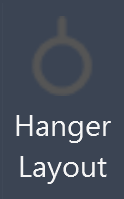

Click **Hanger Layout**. The modeless dialog opens:

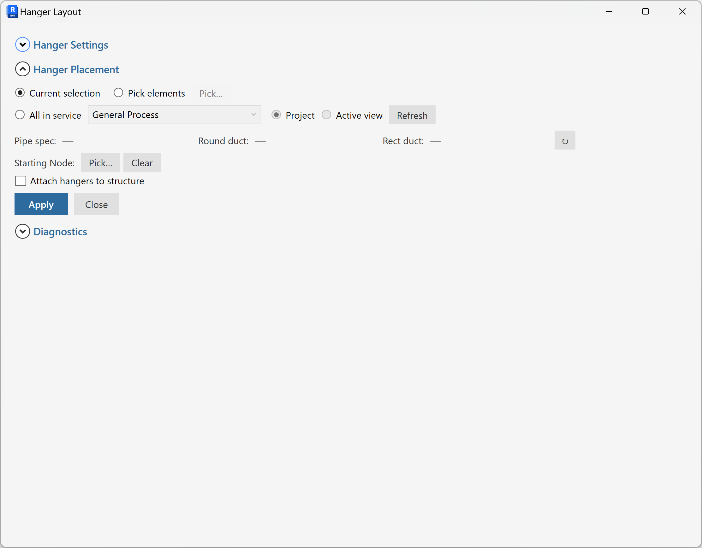

The dialog is **modeless** — you can keep working in Revit (selecting,
panning, zooming) while it's open.

---

## The three expanders

The dialog body is organized into three collapsible sections:

1. **Hanger Settings** (collapsed by default) — where you define and
   manage your specs.
2. **Hanger Placement** (expanded by default) — the primary workflow:
   pick a service, apply the spec to a selection.
3. **Diagnostics** (collapsed by default) — utility commands for
   investigating Fab catalog quirks. Most users never open this.

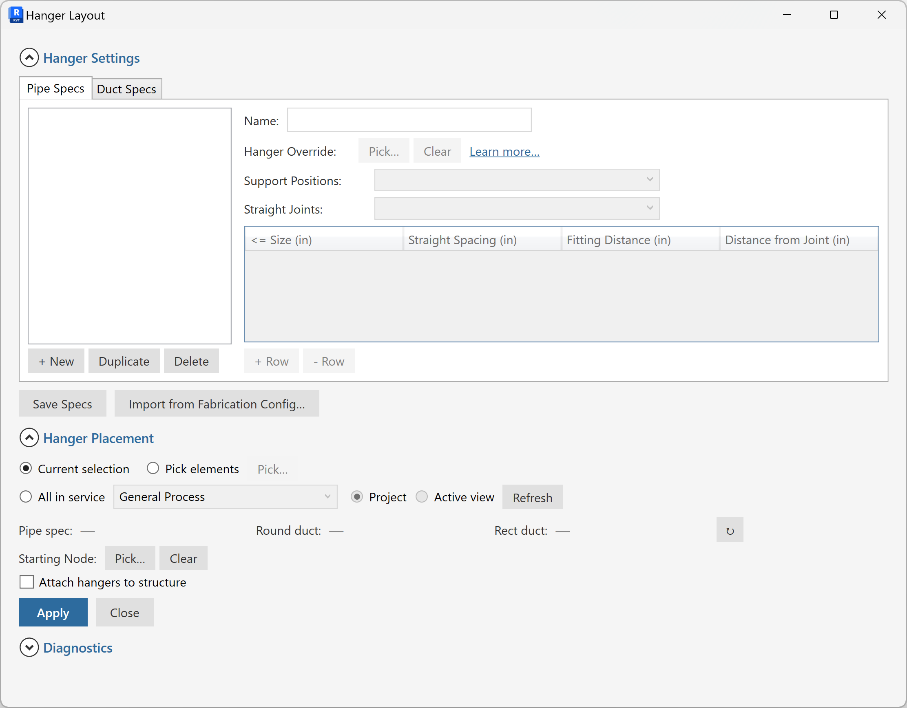

---

## Defining specs

Open **Hanger Settings**. There are two tabs:

- **Pipe Specs** — for pipes (and pipe-domain Fab parts).
- **Duct Specs** — for ducts (round and/or rectangular).

### Add a new spec

Click **Add Spec** above the list. A new spec appears with a default
name. Click the name to rename.

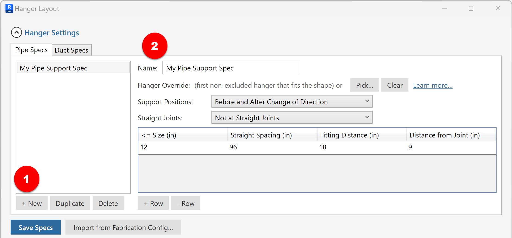

Add size-band rows by clicking **Add Row** under the size-band table:

- **Max Size** — the spec row applies to parts whose nominal size is at
  most this value (in inches).
- **Spacing** — distance between consecutive hangers along a straight
  (inches).
- **Fitting Distance** — setback from a fitting (elbow, tee, etc.) before
  the first/last hanger (inches).
- **Joint Distance** — setback from a joint (coupling, flange, weld)
  before the first/last hanger (inches).

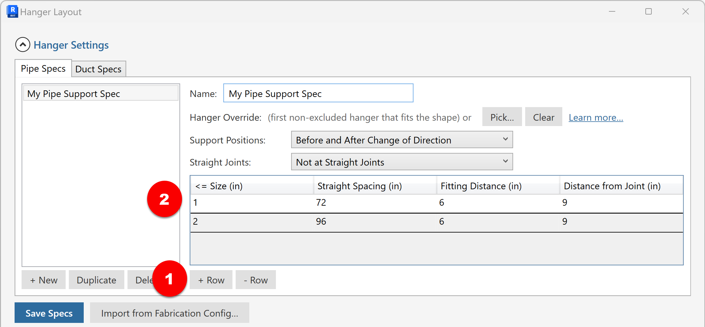

Multiple rows can describe a single spec. The placer picks the row whose
**Max Size** is the smallest value ≥ the part's size.

### Duct shape filter (Duct Specs only)

On the Duct Specs tab, each spec has a **Shape** dropdown:

- **Any** — applies to both round and rectangular ducts.
- **Round** — only round.
- **Rectangular** — only rectangular.

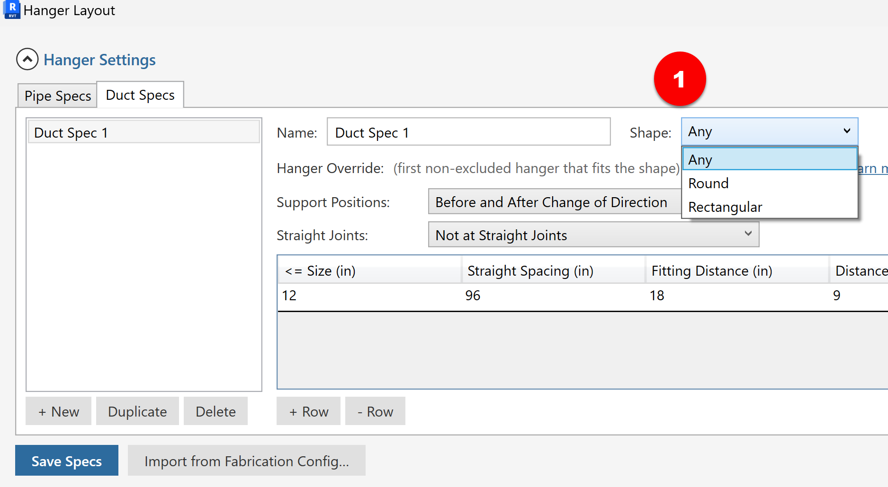

Use this when you want different spacing rules for round vs rectangular
duct (typical — round duct usually allows wider spacing).

### Hanger Override

Below the size-band table, each spec has a **Hanger Override** row:

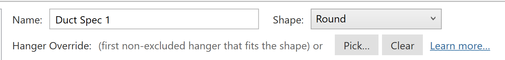

By default it reads:

> (first non-excluded hanger that fits the shape) or [Pick…] [Clear] [Learn more…]

This means the placer will automatically pick a hanger button that's
compatible with the part's shape. Click **Learn more…** for the full
selection precedence — short version:

1. Hanger names containing **ROUND** or **PIPE** are preferred for round
   hosts.
2. Names containing **RECTANGULAR**, **BEARER**, or **TRAPEZE** are
   preferred for rectangular hosts.
3. Otherwise, the first non-excluded hanger in the service is used.

If you want to pin a specific hanger, click **Pick…** to choose one from
the service's hanger buttons. Click **Clear** to revert to auto.

### Save your specs

Click **Save Specs** at the bottom. Specs are written to ExtensibleStorage
on the project and persist across save/close.

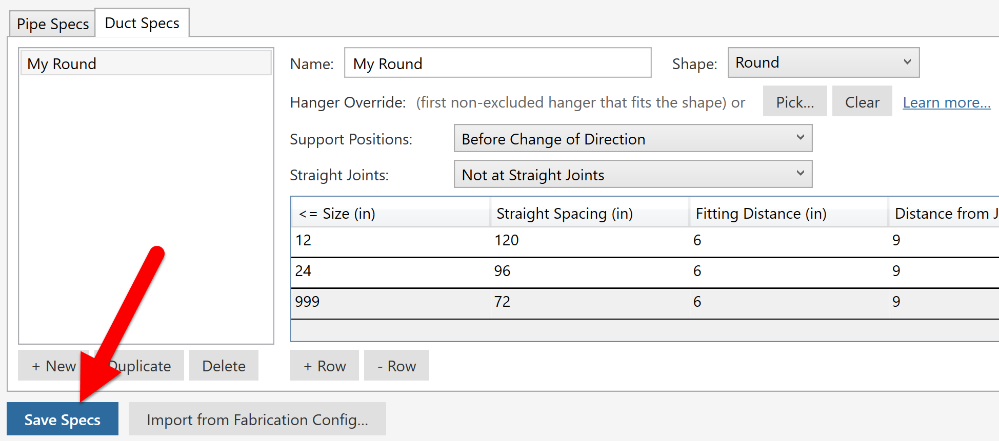

The dialog tracks unsaved changes — if you close it with edits unsaved,
it prompts you.

---

## Importing from Fabrication Config

If you already have hanger specifications defined in Autodesk Fabrication
ESTmep / CADmep / CAMduct, you can import them directly.

Click **Import from Fab** (in Hanger Settings):

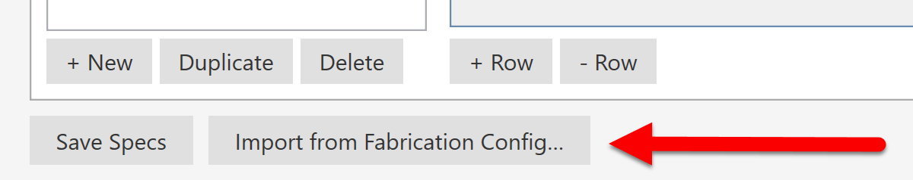

On first use, you'll get a file picker — browse to your Fab Database
folder and pick `HSpecs.MAP`. The tool remembers the folder, so subsequent
imports skip the prompt.

You'll get a choice dialog:

- **Replace All** — clears the current domain's specs and installs the
  imported ones. Existing specs are lost.
- **Merge** — keeps existing specs and adds the imported ones. Duplicate
  names get suffixed.
- **Cancel** — leaves everything alone.

Imported specs are marked dirty — review them and **Save Specs** to
commit.

---

## Applying specs

Open **Hanger Placement**.

### 1. Choose a Service

The Service dropdown lists Piping / Duct Types in your project. Pick the
one whose hanger buttons you want to use.

### 2. Pick the specs to apply

- **Pipe Spec** dropdown — pick which Pipe Spec to apply to selected
  pipes.
- **Round Duct Spec** dropdown — pick a spec to apply to selected round
  ducts.
- **Rect Duct Spec** dropdown — pick a spec to apply to selected
  rectangular ducts.

If your selection only contains pipes, the duct dropdowns are ignored
(and vice versa).

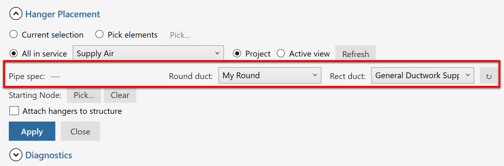

### 3. (Optional) Pick a Start Node

If you have a long chain of parts and want hangers to start spacing from
a specific end, click **Pick Start Node** and click on the part at the
end you want to start from. The flow-map orients the chain to that side.

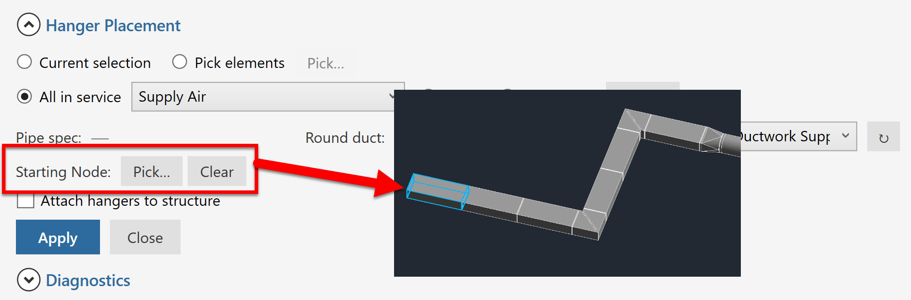

Without a Start Node, the placer picks an end automatically.

### 4. Select parts in Revit

In the Revit view, select the fabrication pipes and/or ducts you want to
add hangers to. You can select:

- A single straight.
- A chain of straights joined by fittings/couplings.
- Multiple disconnected runs (each handled independently).

### 5. Click Apply

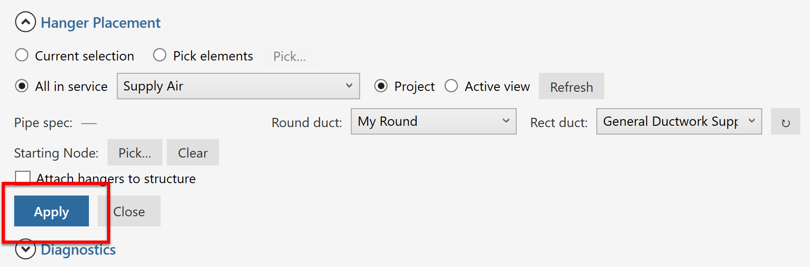

The placer runs in a single transaction. You'll see:

- Hangers appear in the model at the computed positions.
- A status line at the bottom of the dialog tells you how many were
  placed (and how many were skipped, if any).

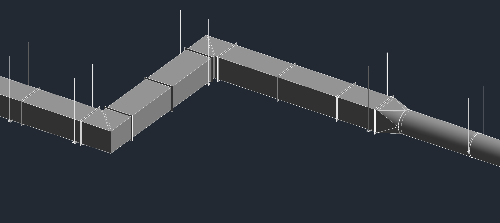

---

## Hanger Settings — what each setting does

Beyond the per-spec rows, the Hanger Settings expander has a few
project-wide controls:

### Joint mode

- **Don't span joints** — hangers don't sit at joints; if a chain spans
  multiple straights via couplings/flanges, each straight gets its own
  hanger pattern.
- **Span across joints** (recommended for most workflows) — hangers
  space continuously across joint pieces, treating the joint as a small
  gap.

### Exclude these hangers

A free-text list of hanger button names (one per line) that the auto-
picker should skip. Useful when your service has placeholder /
deprecated hanger buttons you don't want auto-selected.

---

## Diagnostics expander

Power-user / debug commands. Most users never need this.

- **Dump HSpecs.MAP** — write the parsed contents of `HSpecs.MAP` to a
  text file for inspection. Useful when an Import doesn't pull what you
  expected.
- **Dump SUPPORT.MAP** — same for the broader Support map (links hanger
  components to specs).

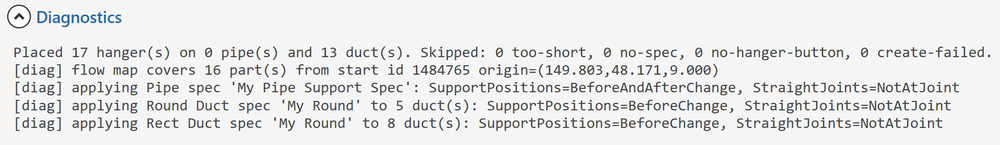

These write to a path you choose via a Save dialog.

---

## Frequently asked

### "I picked a Service but no hangers appeared after Apply."

Likely one of:

- The selection has no straight parts in it (the placer skips fittings).
- The Service has no compatible hanger buttons. Open the Hanger Override
  for the spec and try Pick… to see what's available.
- The spec has no size-band rows. Add at least one.

### "Hangers ended up on top of fittings."

Check the **Fitting Distance** and **Joint Distance** values on the spec
row that matched the part's size. Setbacks may be set to 0 or smaller
than your fittings.

### "Spacing seems off by a few inches on chains with flanges."

The placer accounts for the flange's own length in the chain spacing.
If you see a small offset:

- Verify the flange piece is a fabrication "joint" type (coupling,
  flange, weld). Custom joint families may not be recognized.
- Open Diagnostics → Dump SUPPORT.MAP to see how Fab classifies the
  piece.

### "Round and Rectangular duct specs both apply to a mixed run."

Each duct in the selection gets routed to its own spec based on shape.
A single chain with a Round → Rect reducer gets Round-spec hangers on
the round side and Rect-spec hangers on the rect side. If you want both
sides to use the same spec, set the Shape on that spec to **Any**.

### "How do I share specs across projects?"

Currently specs live on the project. Workarounds:

- Use the Import from Fab feature so your team's Fab `HSpecs.MAP` is
  the source of truth.
- A JSON export/import feature is on the backlog —
  [contributions welcome](https://github.com/sbuchanan01/hanger-layout-for-revit/issues).

---

## Reporting bugs and asking for features

[GitHub Issues](https://github.com/sbuchanan01/hanger-layout-for-revit/issues).

When reporting a placement bug, please include:
- Revit version + build number (Help → About).
- A screenshot of the dialog with the relevant spec visible.
- A minimal sample model (or a description of the part configuration).
- What you expected, what happened.
